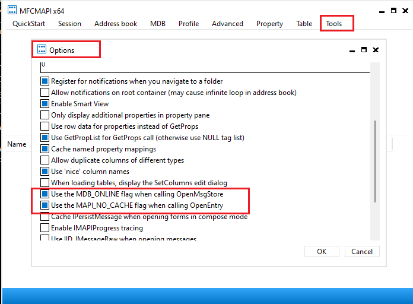
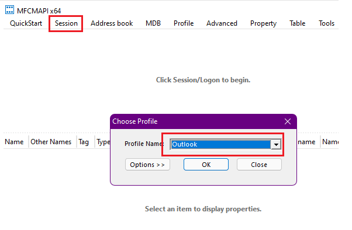
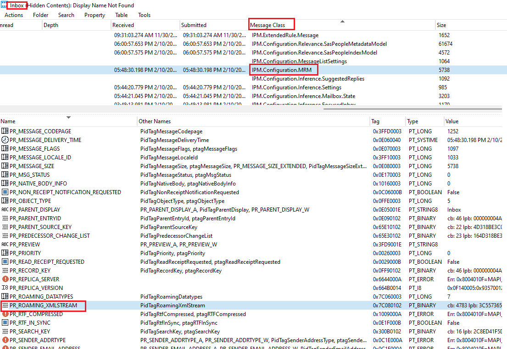
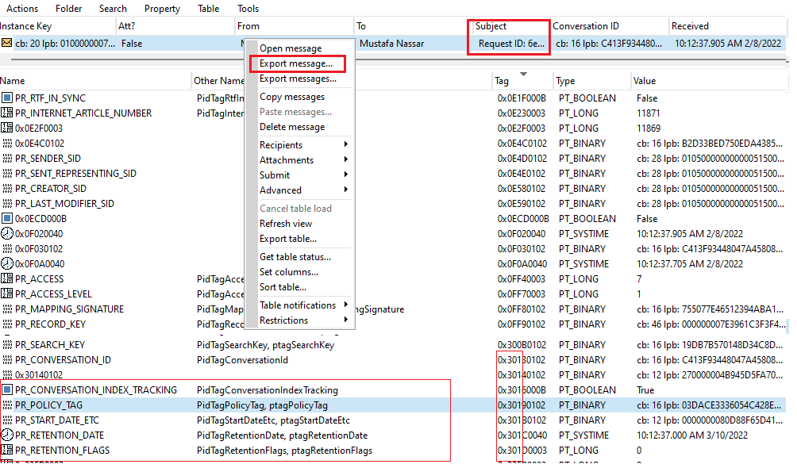
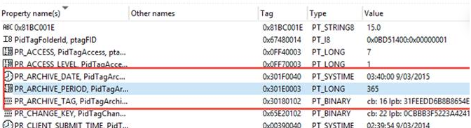

# How to Use MFCMapi to Troubleshoot Messaging records management (MRM).

If you're dealing with retention policy issues in Exchange Online
(M365), then you need to know how to use MFCMapi to troubleshoot them.
In our previous article, "[**Troubleshooting Retention Policies in
Exchange
Online**](https://www.linkedin.com/pulse/troubleshooting-retention-policies-exchange-online-part-1-nassar/)",
we covered the basics of retention policies and why they're important.
Now, in this article, we'll dive deeper into the tool that can help you
troubleshoot those issues: MFCMapi. By the end of this article, you'll
be able to use MFCMapi to check mailbox clients and items, understand
MAPI properties, and find individual problematic items. So, if you're
ready to master retention policies, let's get started!

First, download MFCMapi from the internet. Once you have it, start the
program and put it in an "Online" mode by going to **Tools** \>
**Options** and selecting "Use **MDB_ONLINE**" and "**MAPI_NO_CACHE**."

Next, go to **Session** \> **Logon** and open the profile name of
interest.

From there, open the **Root Container** \> **Top of Information Store**
\> right-click on the Inbox \> right-click to **Open Associated Contents
Table**. Sort the results by Message Class and look for the only item
that has Message Class = **IPM. Configuration.MRM**. Look for the
property PR_ROAMING_XMLSTEAM – double-click it and view the Steam (Text)
window. Copy the Text to any XML editor you like (for example: Notepad++
).

If you think that certain item/items are the main issue, you may quickly
examine them using the procedures below:

Double-click on the impacted folder or right-click \> Open content
table.

Locate the message using the subject, sender, recipient or received
date.

**PR_ARCHIVE_DATE** - 0x301F0040 - DateTime

DateTime for item archival. This is a calculated property when cached or
offline and is stamped by Exchange when online on every item.

**PR_ARCHIVE_TAG** - 0x30180102 - GUID

The archive policy an item is under (either implicit or explicit).
Stamped on every item. Outlook calculates when cached or offline.
Exchange stamps when online. It has a Hex value which you need to
convert to Guid to compare it to the Tags in your file, or you can get
it directly using Get-RetentionTag. Now, if we run
Get-RetentionPolicyTag and compare each tag RetentionId with the Guid
above, we will find out which retention tag is applied to the item.

By following these steps, you'll be able to quickly identify and fix
retention issues with your Exchange mailboxes. For more information on
troubleshooting retention issues, check out the Microsoft Docs article
[**Search and Replace Retention tag on Microsoft Exchange 2010
(MRM)**](https://learn.microsoft.com/en-us/exchange/security-and-compliance/messaging-records-management/retention-tags-and-policies)

I hope you find this information helpful when troubleshooting your next
retention case.

